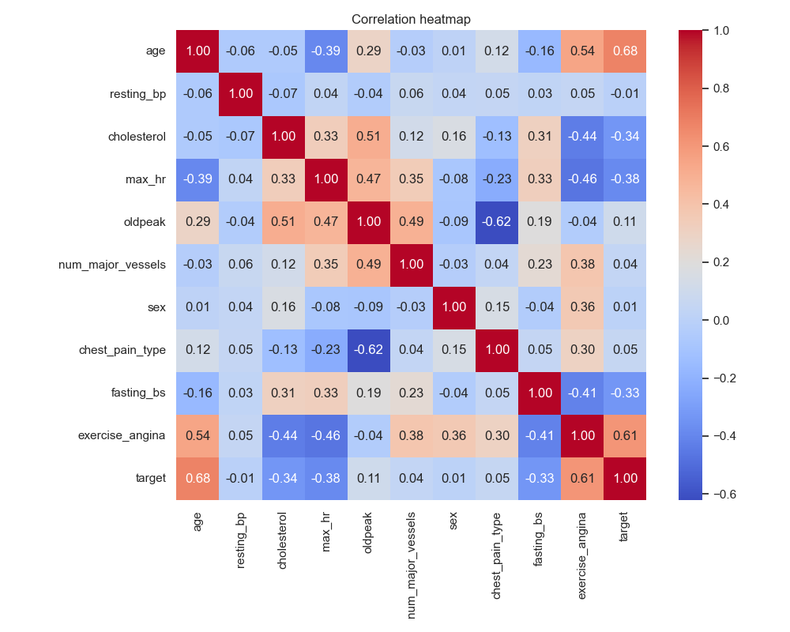
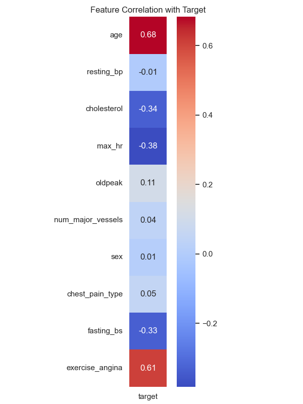
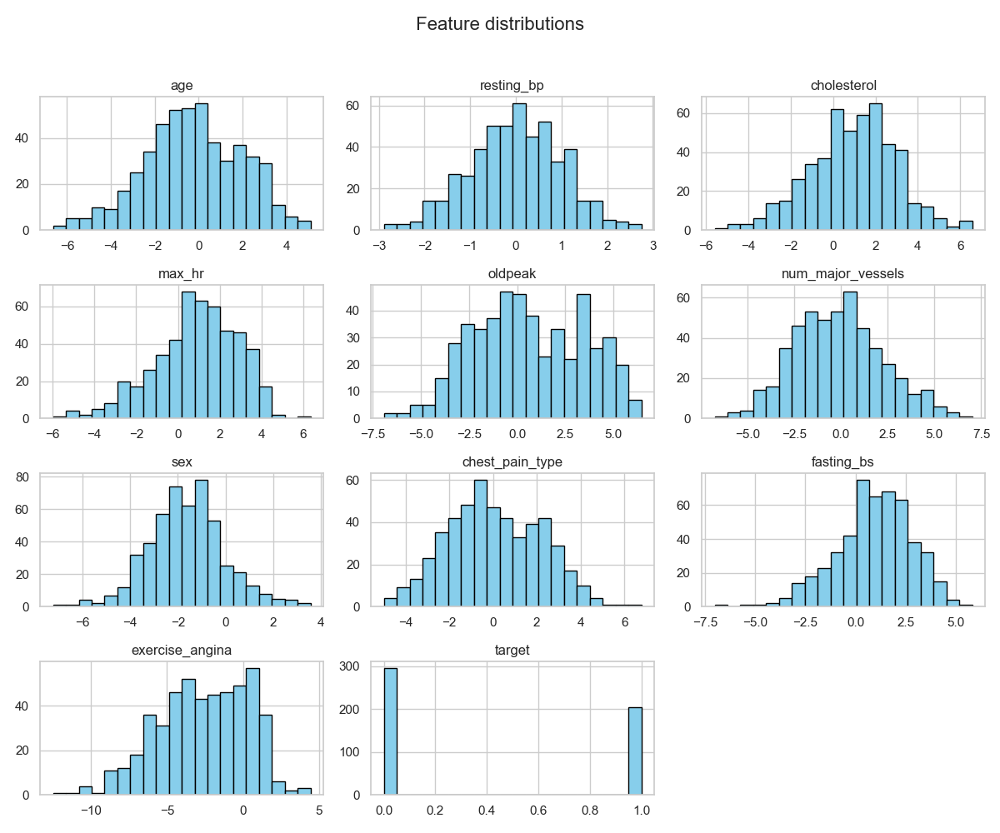
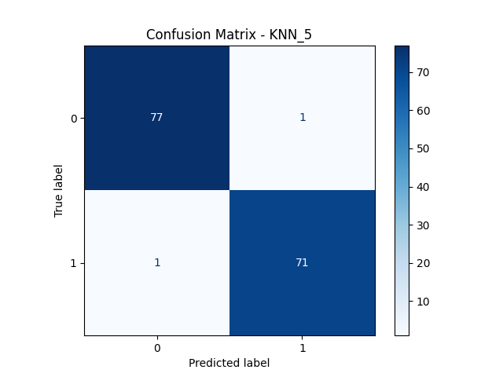
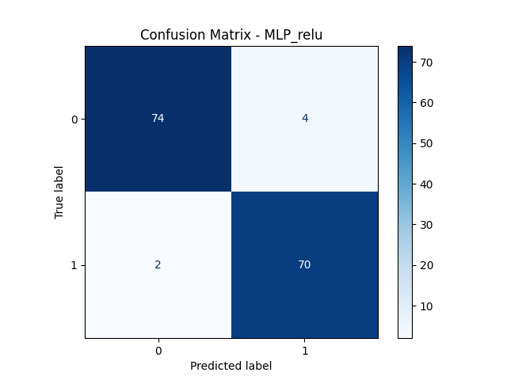

# Heart Disease Prediction - Model evaluation and comparison

This assignment, part of the Data Analysis course at Dorset College, focuses on predicting heart disease using a synthetic dataset. The goal is to explore the data, apply preprocessing techniques, and assess the performance of different classification algorithms.

## 1. Data Exploration and Preprocessing

The first step of the project was to take a closer look at the dataset and get it ready for training machine learning models. This includes checking the structure of the data, looking for missing values, and making sure everything is in the right format.

### Data summary

After checking the dataset, we saw that it was already fully preprocessed. The features were normalized and standardized, which means they were all on the same scale. There were no missing values, and all columns were in numerical format: floats for the features and an integer for the target column. Since no additional data cleaning or transformation was needed, the dataset will be used as it is in the next step.

> [!NOTE]
> All results obtained from the EDA are available in the [appendix](#result-of-the-eda).

### Visualisations

A first heatmap was made to show the correlations between all the numerical features in the dataset. This is something we usually do in data analysis to get an overview of how the variables are related to each other, including the target.  
But since in this project we’re mainly interested in predicting the target (last column of the matrix), we also created a second heatmap that only shows the correlation between each feature and the target. This gives a clearer idea of which features are the most important for our predictions.
<div style="display: flex; gap: 20px; align-items: center; margin-bottom: 40px;justify-content: center;">
  
  
</div>

We also made a chart to show how the target classes are distributed. This helps us see if the dataset is balanced, which is important to judge how well the models really perform.

<div style="display: flex; align-items: center; margin-bottom: 40px; justify-content: center;">
  
</div>

## 2. Model Training

In this part, we trained different classification models on the dataset. First, we split the data into two parts: 70% for training the models and 30% for testing them. This way, we can train on most of the data while keeping a good part aside to check how well the models work.

As specified in the first part, the dataset is already preprocessed. Therefore, we can create a separate file for models' training and simply import the file without any issues. This helps keep the folder clean and well-organized.  
The code used to train and evaluate the models can be found in [`/code/model.py`](/code/model.py)

### K-Nearest Neighbors (KNN)

The first model we trained is the KNN classifier. KNN is a simple but effective algorithm that predicts the label of a data point by looking at the labels of its closest neighbors in the training set.
Unlike other models, KNN does not really “learn” during the training phase. The `fit` from [scikit-learn](https://scikit-learn.org/stable/modules/generated/sklearn.neighbors.KNeighborsClassifier.html#sklearn.neighbors.KNeighborsClassifier.fit) function simply stores the training data in a smart way to make future searches faster during prediction.  
For KNN, we tested 7 different values for the hyperparameter $k$, ranging from 3 to 10, and we always used the Minkowski distance.

### Support Vector Machine (SVM)

The second model we trained is the SVM classifier. SVM tries to find the best boundary (called a hyperplane) to separate different classes in the data. It works well for both simple and complex datasets.
For the SVM, we tested different kernel functions provided by scikit-learn, including the Linear, the Polynomial, the Radial Basis Function (RBF) and the Sigmoid kernel, using the default regularization parameter `C=1.0`.

### Multilayer Perceptron (MLP)

The last model we trained is the MLP classifier. MLP is a type of neural network that can learn complex relationships in the data by using several layers of neurons.
We also tested different activation functions provided by scikit-learn: logistic, tanh, relu, and identity, to evaluate which one performed best with the dataset.

When training the Multilayer Perceptron MLP model, we encountered instabilities during the process, resulting in multiple warnings such as “divide by zero” and “overflow” during matrix multiplication.  
We initially thought the issue might be with the dataset, as the data might not have been normalized enough for the MLP. While the KNN and SVM models didn’t have this problem, we applied a MinMaxScaler to re-normalize the data between 0 and 1.

However, even after this, the MLP still failed to converge.  
So, we attempted to improve the situation by changing the hyperparameters multiple times, testing different configurations for the `solver`, `learning_rate_init`, `alpha`, `max_iter` and the `hidden_layer_sizes`.  
After several iterations, we settled on the following configuration:
```python
mlp = MLPClassifier(max_iter=2000, activation=activation_function, early_stopping=True, alpha=0.01, solver='lbfgs', hidden_layer_sizes=(10,))
```
Seeing that, even with this tries, the model still failed to converge and we were unable to find other improvements, we decided to revert to the initial configuration (the default scikit-learn hyperparameters) for comparison with the other models.

## 3. Comparative Analysis

> [!NOTE]
> All results of the training can be found in the [appendix](#result-of-the-training).

Here, we present only the best configurations for each model. It is interesting to note that the results of the KNN with $k=6$, turned out to be identical to those of the SVM, as the MLP with ReLU and Tanh, highlighting a remarkable coincidence. Furthermore, the best configurations for each model are the same than the default settings provided by scikit-learn, which suggests that these configurations are already optimal for most of datasets.  
It is also interesting to note that KNN with $k=6$ and SVM predicted exactly the same outcomes, while MLP with ReLU and MLP with Tanh activations achieved the same scores but with different confusion matrices.

| Model     | Configuration   | Accuracy | Precision | Recall | F1 Score |
|-----------|-----------------|----------|-----------|--------|----------|
| KNN       | $k = 5$         | 0.9867   | 0.9861    | 0.9861 | 0.9861   |
| KNN       | $k = 6$         | 0.9867   | 1.0000    | 0.9722 | 0.9859   |
| SVM       | RBF Kernel      | 0.9867   | 1.0000    | 0.9722 | 0.9859   |
| MLP       | ReLU activation | 0.9667   | 0.9855    | 0.9444 | 0.9645   |
| MLP       | Tanh activation | 0.9667   | 0.9855    | 0.9444 | 0.9645   |

<div style="display: grid; grid-template-columns: repeat(2, 3fr); gap: 10px; justify-items: center; margin-bottom: 40px;">
  

  
  
  
  
</div>

The KNN model with $k = 5$ and $k = 6$ both showed excellent performance, with high accuracy, precision, recall, and F1 scores. The SVM model with an RBF kernel also performed very well, matching the KNN model in accuracy and precision. However, KNN can be computationally expensive with large datasets due to its instance-based learning approach, and SVM can be complex to tune and interpret. The MLP model with ReLU activation showed slightly lower performance and it's more computationally intensive and less interpretable than KNN and SVM. Overall, it seems that here the SVM is the most suitable in our case.

The dataset seems to be too small for a MLP model. That's surely one of the main reason of the warnings encountered during the training. However, due to the relatively simple and well-separated nature of the dataset, the MLP was still able to reach strong performance, with high accuracy and good results overall.

## Reflection Questions

**1. Which evaluation metric do you consider most important for this dataset, and why?**  
For this dataset, I consider that recall is the most important metric. In a medical context, it is crucial not to miss any individuals who have the disease, even if that means some healthy people may be misclassified as sick. This is because a false negative (where someone with heart disease is classified as healthy) could lead to missed diagnoses, delaying necessary treatment.

**2. How does the choice of model affect the balance between bias and variance?**  
- KNN has low bias because it can adapt to complex patterns in the data, but it tends to have high variance because it is sensitive to the specific training data.
- SVM can have either low bias or high bias, depending on the kernel and regularization parameter. When the kernel is well-chosen, SVM can have low bias and moderate variance, making it a good balance.
- MLP generally has low bias because it can model complex relationships, but it is prone to high variance if not properly regularized or tuned, especially with small datasets.

**3. If you were to deploy one of these models in a real-world setting, which would you choose and why?**  
If I have to deploy one of these models in a real-world setting, I would choose the SVM with the RBF kernel. It performed very well and the simplicity of the SVM model and its good generalization properties make it a good choice for real-world use. On the other hand, KNN would be too computationally expensive to handle large-scale datasets, like those of an entire country.

## Appendix

### Result of the EDA

| Feature           | Count | Mean      | Std      | Min        | 25%       | 50%       | 75%       | Max      |
|:------------------|:------|:----------|:---------|:-----------|:----------|:----------|:----------|:---------|
| age               | 500.0 | -0.240697 | 2.236264 | -6.637937  | -1.731686 | -0.271554 | 1.418476  | 5.091704 |
| resting_bp        | 500.0 | 0.002554  | 1.011668 | -2.891833  | -0.650030 | 0.032846  | 0.707191  | 2.748645 |
| cholesterol       | 500.0 | 0.952978  | 2.027121 | -5.591194  | -0.344919 | 1.088140  | 2.298920  | 6.563156 |
| max_hr            | 500.0 | 0.891863  | 1.990966 | -5.979594  | -0.235558 | 1.035698  | 2.226467  | 6.346779 |
| oldpeak           | 500.0 | 0.599015  | 2.858443 | -6.915749  | -1.563770 | 0.327706  | 3.141920  | 6.440231 |
| num_major_vessels | 500.0 | -0.126711 | 2.363934 | -6.749837  | -1.835318 | -0.183129 | 1.423795  | 7.014193 |
| sex               | 500.0 | -1.617820 | 1.592002 | -7.218200  | -2.622877 | -1.671415 | -0.686045 | 3.557356 |
| chest_pain_type   | 500.0 | 0.089429  | 2.126706 | -4.992435  | -1.465407 | -0.077492 | 1.794532  | 6.771795 |
| fasting_bs        | 500.0 | 0.906553  | 1.882720 | -7.019296  | -0.243922 | 1.066285  | 2.206591  | 5.803134 |
| exercise_angina   | 500.0 | -2.629439 | 2.956567 | -12.484286 | -4.719322 | -2.454379 | -0.062064 | 4.434569 |
| target            | 500.0 | 0.408000  | 0.491955 | 0.000000   | 0.000000  | 0.000000  | 1.000000  | 1.000000 |

```
+---------------+
| Dataset infos |
+---------------+
<class 'pandas.core.frame.DataFrame'>
RangeIndex: 500 entries, 0 to 499
Data columns (total 11 columns):
 #   Column             Non-Null Count  Dtype  
---  ------             --------------  -----  
 0   age                500 non-null    float64
 1   resting_bp         500 non-null    float64
 2   cholesterol        500 non-null    float64
 3   max_hr             500 non-null    float64
 4   oldpeak            500 non-null    float64
 5   num_major_vessels  500 non-null    float64
 6   sex                500 non-null    float64
 7   chest_pain_type    500 non-null    float64
 8   fasting_bs         500 non-null    float64
 9   exercise_angina    500 non-null    float64
 10  target             500 non-null    int64  
dtypes: float64(10), int64(1)
memory usage: 43.1 KB
None
+----------------+
| Missing values |
+----------------+
age                  0
resting_bp           0
cholesterol          0
max_hr               0
oldpeak              0
num_major_vessels    0
sex                  0
chest_pain_type      0
fasting_bs           0
exercise_angina      0
target               0
dtype: int64
```

### Result of the training

They can also be found in [`resources/results.txt`](/resources/results.txt)

#### KNN

| $k$ | Accuracy | Precision | Recall | F1 Score |
|-----|----------|-----------|--------|----------|
| 3   | 0.9600   | 0.9714    | 0.9444 | 0.9577   |
| 4   | 0.9667   | 1.0000    | 0.9306 | 0.9640   |
| 5   | 0.9867   | 0.9861    | 0.9861 | 0.9861   |
| 6   | 0.9867   | 1.0000    | 0.9722 | 0.9859   |
| 7   | 0.9867   | 0.9861    | 0.9861 | 0.9861   |
| 8   | 0.9600   | 0.9853    | 0.9306 | 0.9571   |
| 9   | 0.9733   | 0.9857    | 0.9583 | 0.9718   |
| 10  | 0.9667   | 0.9855    | 0.9444 | 0.9645   |

#### SVM

| Kernel       | Accuracy | Precision | Recall | F1 Score |
|------------|----------|-----------|--------|----------|
| Linear     | 0.9133   | 0.8933    | 0.9306 | 0.9116   |
| Polynomial | 0.9400   | 0.9846    | 0.8889 | 0.9343   |
| RBF        | 0.9867   | 1.0000    | 0.9722 | 0.9859   |
| Sigmoïd    | 0.7933   | 0.8154    | 0.7361 | 0.7737   |

#### MLP

This is the results with the default hyperparameters.

| Activation function | Accuracy | Precision | Recall | F1 Score |
|---------------------|----------|-----------|--------|----------|
| ReLU                | 0.9667   | 0.9855    | 0.9444 | 0.9645   |
| Identity            | 0.9133   | 0.9041    | 0.9167 | 0.9103   |
| Sigmoïd / Logistic  | 0.9200   | 0.9054    | 0.9306 | 0.9178   |
| Tanh                | 0.9667   | 0.9855    | 0.9444 | 0.9645   |

This is the results with the custom hyperparameters, as specified in the [MLP training report](#multilayer-perceptron-mlp)

| Activation function | Accuracy | Precision | Recall | F1 Score |
|---------------------|----------|-----------|--------|----------|
| ReLU                | 0.9600   | 0.9459    | 0.9722 | 0.9589   |
| Identity            | 0.9067   | 0.9028    | 0.9028 | 0.9028   |
| Sigmoïd / Logistic  | 0.9533   | 0.9851    | 0.9167 | 0.9496   |
| Tanh                | 0.9467   | 0.9571    | 0.9306 | 0.9437   |